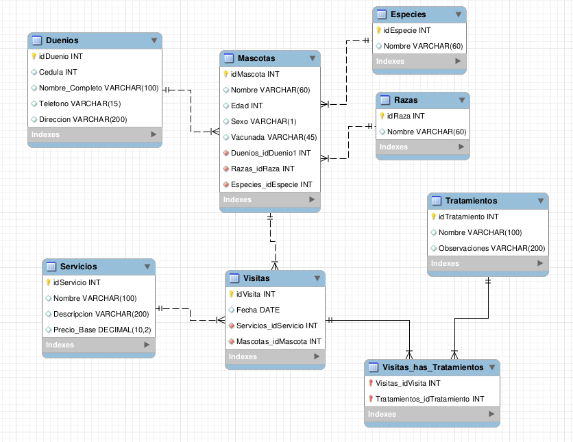

# Base de Datos Veterinaria Mi Mejor Amigo

Este taller muestra el diseño y manipulación de una base de datos para la veterinaria "Mi Mejor Amigo". El objetivo es organizar la información de dueños, mascotas, servicios, visitas y tratamientos.

## Diseño de la Base de Datos

## Proceso de Desarrollo

Se realizó en cuatro etapas principales:

1. **Diagrama UML E-R:** Se identificaron las entidades principales (Dueño, Mascota, Servicio, Visita, Tratamiento) y sus relaciones. Se definieron las cardinalidades como que un dueño puede tener muchas mascotas, pero una mascota pertenece a un solo dueño. También se crearon tablas adicionales para Especies y Razas para normalizar la información.

2. **Archivo DDL:** Se creó la base de datos y las tablas con sus respectivas llaves primarias, foráneas y restricciones. Se usaron tipos de datos como INT, VARCHAR, DATE y DECIMAL.

3. **Archivo DML:** Se insertaron datos de prueba para verificar el funcionamiento. Se registraron 5 dueños, 10 mascotas, 5 servicios, 10 visitas y 5 tratamientos tomando en cuenta las relaciones entre las tablas.

4. **Archivo DQL:** Se elaboraron consultas para extraer información. Estas consultas incluyen el uso de alias, funciones de agregación, concatenación, subcadenas, condicionales y uniones entre tablas.

